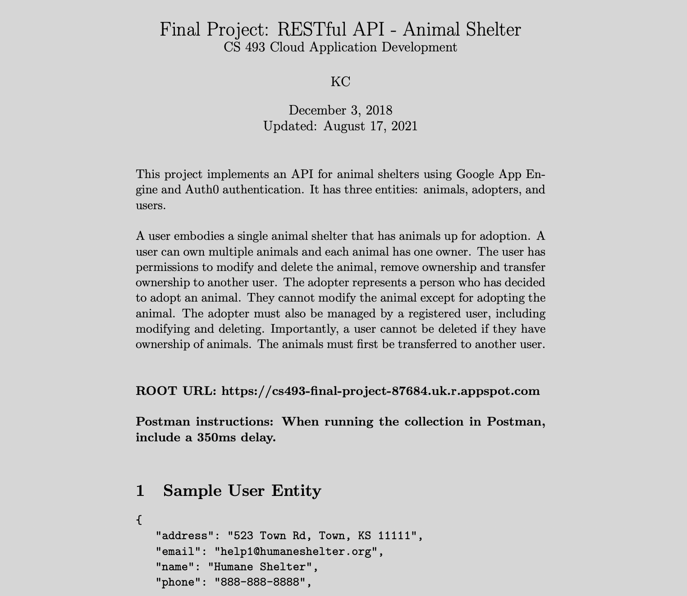

# Pet Shelter RESTful API
This pet shelter API implements user authentication, authorization, status codes, RESTful urls, and pagination. Implemented with Google Cloud Datastore and Google App Engine.

## Description

